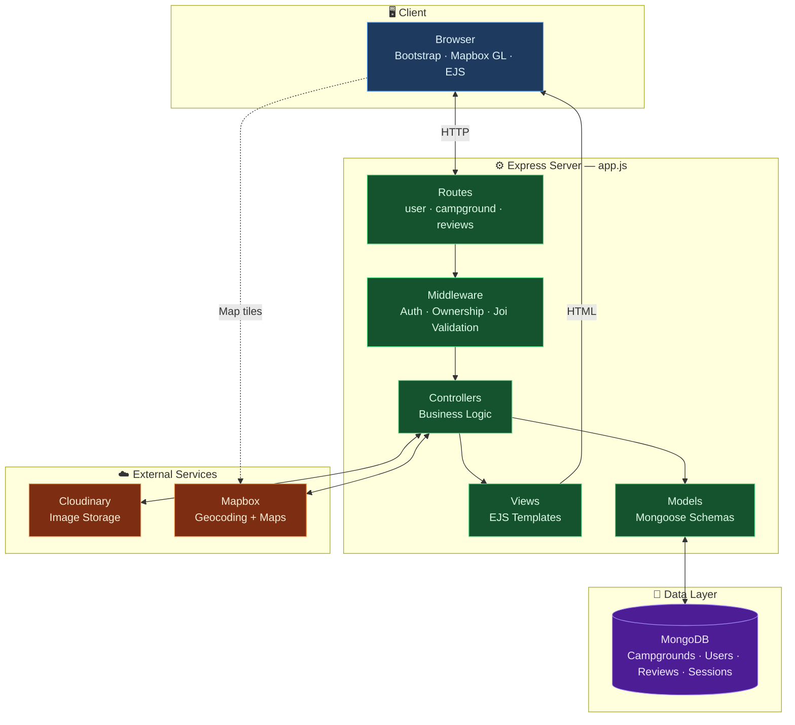
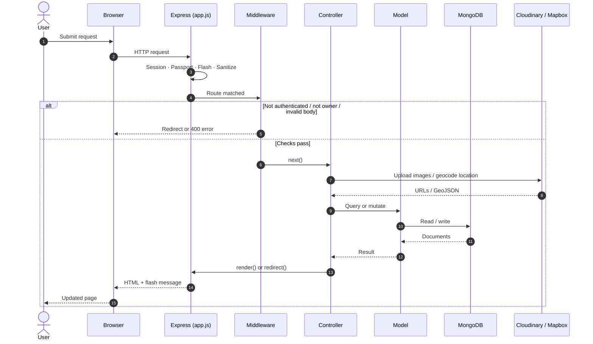
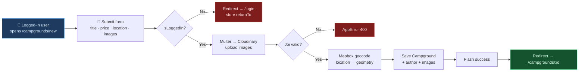
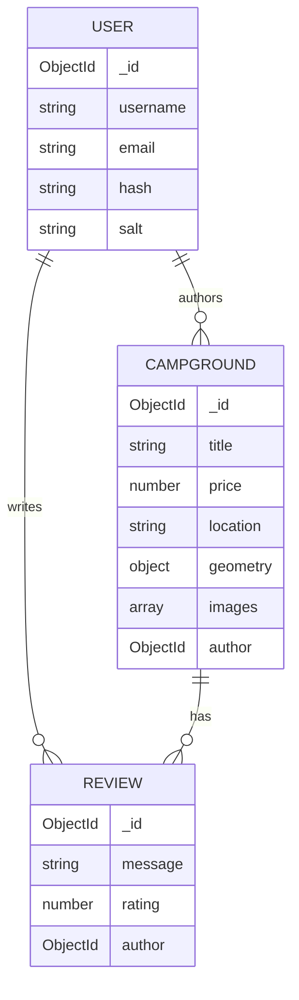

# YelpCamp

A full-stack campground discovery and review platform. Users can browse campgrounds on an interactive map, create listings with photos and geocoded locations, and leave star ratings and reviews. Built with Node.js, Express, MongoDB, and EJS following an MVC architecture.

**Author:** Md Ashraful Alam

---

## Table of Contents

- [Overview](#overview)
- [Features](#features)
- [Tech Stack](#tech-stack)
- [Project Structure](#project-structure)
- [Architecture](#architecture)
- [Data Models](#data-models)
- [Routes & API](#routes--api)
- [Middleware](#middleware)
- [Security](#security)
- [Third-Party Integrations](#third-party-integrations)
- [Environment Variables](#environment-variables)
- [Getting Started](#getting-started)
- [Seeding the Database](#seeding-the-database)
- [How Key Flows Work](#how-key-flows-work)
- [Frontend Assets](#frontend-assets)
- [Error Handling](#error-handling)
- [License](#license)

---

## Overview

YelpCamp is a Yelp-style application focused on campgrounds. Authenticated users can create campgrounds with images and a location string; Mapbox geocodes that location into GeoJSON coordinates for map display. Other users can leave reviews (1–5 stars) on campgrounds. Ownership checks ensure only the author of a campground or review can edit or delete it.

The app entry point is `app.js`, which wires Express, MongoDB, sessions, Passport authentication, flash messages, and the route modules.

---

## Features

| Feature | Description |
|--------|-------------|
| **Landing page** | Cover-style home page introducing the app |
| **Campground CRUD** | Create, list, view, edit, and delete campgrounds |
| **Image uploads** | Multiple images per campground via Multer → Cloudinary |
| **Image management** | Add new images and selectively delete existing ones on edit |
| **Geocoding** | Location text converted to coordinates with Mapbox Geocoding API |
| **Cluster map** | Index page shows all campgrounds on a clustered Mapbox GL map |
| **Detail map** | Show page marks the individual campground location |
| **Reviews** | Create, edit, and delete reviews with rating (1–5) and message |
| **Auth** | Register, login, logout with Passport Local + `passport-local-mongoose` |
| **Authorization** | Campground/review mutations restricted to their authors |
| **Flash messages** | Success/error feedback after actions |
| **Return-to URL** | After login, redirect back to the page the user was trying to access |
| **Cascading deletes** | Deleting a campground also deletes its associated reviews |
| **Form validation** | Client-side Bootstrap validation + server-side Joi schemas |
| **XSS protection** | Custom Joi `escapeHTML` rule using `sanitize-html` |
| **NoSQL injection protection** | `express-mongo-sanitize` on all requests |
| **Seed script** | Populate ~300 sample campgrounds for development |

---

## Tech Stack

### Backend
- **Node.js** / **Express.js** — HTTP server and routing
- **MongoDB** / **Mongoose** — database and ODM
- **Passport.js** + **passport-local** + **passport-local-mongoose** — authentication
- **express-session** + **connect-mongo** — sessions stored in MongoDB
- **connect-flash** — one-time flash messages
- **Joi** + **sanitize-html** — request validation and HTML sanitization
- **method-override** — support for `PATCH` / `DELETE` via `_method`
- **Multer** + **multer-storage-cloudinary** — multipart uploads to Cloudinary
- **dotenv** — load environment variables in non-production

### Frontend
- **EJS** + **ejs-mate** — server-rendered templates with layouts
- **Bootstrap 5** — UI components and responsive layout
- **Mapbox GL JS** — interactive maps (cluster + single marker)
- Custom CSS (`public/stylesheet/`) and client JS (`public/javascript/`)

### External Services
- **Cloudinary** — image hosting and transforms (thumbnails)
- **Mapbox** — geocoding and map tiles

---

## Project Structure

```
Yelp-Camp-Project/
├── app.js                 # Application entry point & Express setup
├── package.json
├── .env                   # Environment secrets (not committed)
├── .gitignore
│
├── cloudinary/
│   └── main.js            # Cloudinary config & Multer storage
│
├── controllers/           # Route handler business logic
│   ├── campground.js
│   ├── review.js
│   └── user.js
│
├── middleware/            # Auth, ownership, and validation middleware
│   ├── isLoggedin.js
│   ├── isAuthor.js
│   ├── isOwnReview.js
│   ├── storeReturnTo.js
│   ├── validateCampground.js
│   └── validateReview.js
│
├── models/                # Mongoose schemas
│   ├── campground.js
│   ├── reviewsSchema.js
│   └── user.js
│
├── routes/                # Express routers
│   ├── campground.js
│   ├── reviews.js
│   └── user.js
│
├── Schema/
│   └── joiSchema.js       # Joi validation schemas (+ escapeHTML)
│
├── seeds/                 # Database seed utilities
│   ├── index.js
│   ├── cities.js
│   └── seedHelper.js
│
├── utilis/                # Shared helpers
│   ├── appError.js        # Custom error class
│   └── wrapError.js       # Async error wrapper
│
├── public/
│   ├── javascript/
│   │   ├── clusterMap.js  # Index page cluster map
│   │   ├── showMap.js     # Campground detail map
│   │   └── validateForm.js
│   └── stylesheet/
│       ├── style.css
│       ├── home.css
│       └── stars.css
│
└── views/
    ├── layout/
    │   └── boilerplate.ejs
    ├── partials/
    │   ├── navbar.ejs
    │   ├── footer.ejs
    │   └── flash.ejs
    ├── campgrounds/
    │   ├── home.ejs
    │   ├── index.ejs
    │   ├── show.ejs
    │   ├── new.ejs
    │   └── edit.ejs
    ├── review/
    │   └── edit.ejs
    ├── user/
    │   ├── login.ejs
    │   └── register.ejs
    └── error.ejs
```

---

## Architecture

The app follows **MVC (Model–View–Controller)**:

1. **Routes** (`routes/`) define URL paths, HTTP methods, and which middleware/controllers run.
2. **Middleware** handles auth, ownership, and validation before controllers.
3. **Controllers** contain the business logic (DB queries, geocoding, Cloudinary, redirects).
4. **Models** define Mongoose schemas and relationships.
5. **Views** render HTML with EJS; most pages use `layout/boilerplate.ejs` via ejs-mate.

`app.js` also mounts:
- Static files from `public/`
- Global locals middleware (`currentUser`, `success`, `error` flash)
- A catch-all 404 and a central error-handling middleware

### System overview



### Request lifecycle



### Create campground flow



### Data relationships



---


## Data Models

### User (`models/user.js`)

| Field | Type | Notes |
|-------|------|--------|
| `email` | String | Required, unique |
| `username` | String | Added by `passport-local-mongoose` |
| `hash` / `salt` | String | Password hashing managed by the plugin |

### Campground (`models/campground.js`)

| Field | Type | Notes |
|-------|------|--------|
| `title` | String | |
| `price` | Number | Min 0 |
| `description` | String | |
| `location` | String | Human-readable location |
| `images` | Array of `{ url, filename }` | Cloudinary assets; virtual `thumbnail` (width 200) |
| `author` | ObjectId → User | Creator |
| `reviews` | [ObjectId → Review] | Embedded references |
| `geometry` | GeoJSON Point | `{ type: 'Point', coordinates: [lng, lat] }` |

**Virtuals**
- `images[].thumbnail` — Cloudinary URL resized for edit thumbnails
- `properties.popUpMarkUp` — HTML used in cluster map popups

**Hooks**
- `post('findOneAndDelete')` — deletes all reviews linked to the campground

### Review (`models/reviewsSchema.js`)

| Field | Type | Notes |
|-------|------|--------|
| `message` | String | Review body |
| `rating` | Number | Intended range 1–5 |
| `author` | ObjectId → User | Reviewer |

---

## Routes & API

Base URL: `http://localhost:3000`

### Pages & Auth (`routes/user.js` + home)

| Method | Path | Auth | Description |
|--------|------|------|-------------|
| `GET` | `/` | Public | Landing / home page |
| `GET` | `/register` | Public | Registration form |
| `POST` | `/register` | Public | Create account & auto-login |
| `GET` | `/login` | Public | Login form |
| `POST` | `/login` | Public | Authenticate (Passport local) |
| `GET` | `/logout` | Logged in | End session |

### Campgrounds (`routes/campground.js`) — mounted at `/campgrounds`

| Method | Path | Middleware | Description |
|--------|------|------------|-------------|
| `GET` | `/campgrounds` | — | List all + cluster map |
| `GET` | `/campgrounds/new` | `isLoggedIn` | New campground form |
| `POST` | `/campgrounds` | Multer, `validateCampground` | Create campground |
| `GET` | `/campgrounds/:id` | — | Show details, reviews, map |
| `GET` | `/campgrounds/:id/edit` | `isLoggedIn`, `isAuthor` | Edit form |
| `PATCH` | `/campgrounds/:id` | `isLoggedIn`, `isAuthor`, Multer, validate | Update campground |
| `DELETE` | `/campgrounds/:id` | `isLoggedIn`, `isAuthor` | Delete campground |

> `PATCH` / `DELETE` are sent from forms using `method-override` (`_method`).

### Reviews (`routes/reviews.js`) — mounted at `/campgrounds/:id/reviews`

| Method | Path | Middleware | Description |
|--------|------|------------|-------------|
| `POST` | `/campgrounds/:id/reviews` | `isLoggedIn` | Create review |
| `GET` | `/campgrounds/:id/reviews/edit/:reviewId` | `isOwnReview` | Edit review form |
| `PATCH` | `/campgrounds/:id/reviews/edit/:reviewId` | — | Update review |
| `DELETE` | `/campgrounds/:id/reviews/delete/:reviewId` | `isOwnReview` | Delete review |

Router uses `mergeParams: true` so `:id` (campground) is available inside the review router.

---

## Middleware

| File | Purpose |
|------|---------|
| `isLoggedin.js` | Requires authentication; stores `req.originalUrl` in session for post-login redirect |
| `storeReturnTo.js` | Copies `session.returnTo` → `res.locals.returnTo` before Passport login |
| `isAuthor.js` | Ensures `req.user` owns the campground before edit/delete |
| `isOwnReview.js` | Ensures `req.user` owns the review before edit/delete |
| `validateCampground.js` | Validates body against Joi `campgroundSchema` |
| `validateReview.js` | Validates body against Joi `reviewSchema` (available for review routes) |
| `wrapError.js` | Wraps async controllers so rejected promises go to Express error handler |

---

## Security

- **Password hashing** — handled by `passport-local-mongoose` (salt + hash, not plain text)
- **Session cookies** — `httpOnly: true`, 7-day expiry; sessions persisted in MongoDB via `connect-mongo`
- **Mongo injection** — `express-mongo-sanitize` strips `$` operators from request data
- **XSS / HTML injection** — Joi custom `escapeHTML` rule rejects strings containing HTML (`sanitize-html`)
- **Authorization** — ownership middleware on mutating campground and review routes
- **Flash on auth failure** — Passport `failureFlash` + `failureRedirect` on login

> **Note:** The session secret in `app.js` is currently a hardcoded string. For production, move it (and the DB URL) into environment variables and enable `secure` cookies over HTTPS.

---

## Third-Party Integrations

### Cloudinary (`cloudinary/main.js`)

- Configured with `CLOUDINARY_NAME`, `CLOUDINARY_KEY`, `CLOUDINARY_SECRET`
- Multer storage uploads images to the `YelpCamp` folder
- Allowed formats: `jpeg`, `png`, `jpg`
- On edit, deleted images are removed from Cloudinary with `cloudinary.uploader.destroy`

### Mapbox

- **Geocoding** (`@mapbox/mapbox-sdk`) — forward-geocodes `campground.location` on create/update; stores GeoJSON geometry on the document
- **Maps (client)** — Mapbox GL JS loaded in the boilerplate; token passed from the server into client scripts
- Cluster map on the index page; single marker map on the show page

---

## Environment Variables

Create a `.env` file in the project root (it is gitignored). Required keys used by the codebase:

```env
CLOUDINARY_NAME=your_cloud_name
CLOUDINARY_KEY=your_api_key
CLOUDINARY_SECRET=your_api_secret
MAPBOX_TOKEN=your_mapbox_access_token
DB_URL=mongodb://127.0.0.1:27017/Yelp-Camp
```

| Variable | Used for |
|----------|----------|
| `CLOUDINARY_*` | Image upload/storage |
| `MAPBOX_TOKEN` | Geocoding + client map rendering |
| `DB_URL` | Present for MongoDB connection (see note below) |

> **Current connection behavior:** `app.js` and the seed script connect to the local URI `mongodb://127.0.0.1:27017/Yelp-Camp` directly. `DB_URL` is defined in `.env` but the live connection string in `app.js` is currently hardcoded. Update `mongoose.connect` / session store `url` to use `process.env.DB_URL` when deploying to a remote MongoDB (e.g. Atlas).

`dotenv` is loaded only when `NODE_ENV !== "production"`.

---

## Getting Started

### Prerequisites

- [Node.js](https://nodejs.org/) (LTS recommended)
- [MongoDB](https://www.mongodb.com/) running locally (or a remote URI you wire into the app)
- Cloudinary account
- Mapbox account (access token)

### Installation

1. **Clone the repository**

   ```bash
   git clone https://github.com/alam265/Yelp-Camp-Project.git
   cd Yelp-Camp-Project
   ```

2. **Install dependencies**

   ```bash
   npm install
   ```

3. **Configure environment**

   Create `.env` with the variables listed above.

4. **Start MongoDB** (if using local)

   Ensure MongoDB is running and reachable at `mongodb://127.0.0.1:27017`.

5. **Run the server**

   ```bash
   node app.js
   ```

   There is no `npm start` script in `package.json` yet; run `node app.js` directly.

6. **Open the app**

   Visit [http://localhost:3000](http://localhost:3000).

---

## Seeding the Database

The `seeds/` folder can populate the database with sample campgrounds for development/demo:

```bash
node seeds/index.js
```

What it does:

1. Connects to the same local MongoDB database (`Yelp-Camp`)
2. Deletes all existing campgrounds
3. Creates **300** random campgrounds using:
   - US cities from `seeds/cities.js`
   - Random title parts from `seeds/seedHelper.js` (`descriptors` + `places`)
   - Placeholder Cloudinary images
   - Fixed `author` ObjectId (update this to a real user `_id` from your DB)

After seeding, open `/campgrounds` to browse the data and the cluster map.

---

## How Key Flows Work

### Creating a campground

1. User must be logged in (`isLoggedIn`).
2. Form posts multipart data (`image` files + campground fields).
3. Multer uploads files to Cloudinary; `req.files` holds URLs/filenames.
4. Joi validates title, price, location, description (no HTML).
5. Mapbox geocodes `location` → `geometry`.
6. Campground is saved with `author = req.user._id` and image array.
7. User is redirected to the show page with a success flash.

### Editing a campground

1. Only the author may open the edit form or submit the update.
2. New images are uploaded and pushed onto `images`.
3. Geometry is re-geocoded from the (possibly updated) location.
4. If `deleteImages` is submitted, those files are destroyed on Cloudinary and pulled from the document.

### Reviews

1. Logged-in users post a review on a campground show page.
2. Review is saved and its `_id` is pushed onto `campground.reviews`.
3. Only the review author can edit or delete it (`isOwnReview`).
4. Deleting a review `$pull`s it from the campground and removes the Review document.

### Authentication & return-to

1. Visiting a protected route while logged out stores `req.session.returnTo`.
2. After successful login, `storeReturnTo` exposes that URL and the user is redirected there (or `/campgrounds` by default).

---

## Frontend Assets

| Asset | Role |
|-------|------|
| `views/layout/boilerplate.ejs` | Shared layout: Bootstrap, Mapbox GL, navbar, flash, footer |
| `views/campgrounds/home.ejs` | Standalone dark cover landing page |
| `public/javascript/clusterMap.js` | GeoJSON cluster map for the index page |
| `public/javascript/showMap.js` | Marker map for a single campground |
| `public/javascript/validateForm.js` | Bootstrap client-side form validation |
| `public/stylesheet/stars.css` | Star rating display styles |
| `public/stylesheet/home.css` | Landing page styles |
| `public/stylesheet/style.css` | General app styles |

Flash messages and the current user are available in all views via `res.locals` (`success`, `error`, `currentUser`).

---

## Error Handling

- **`AppError`** (`utilis/appError.js`) — custom error with `message` and `statusCode`
- **`wrapAsync`** (`utilis/wrapError.js`) — catches async controller errors and passes them to `next(err)`
- **404** — `app.all('*')` forwards a “Page Not Found” `AppError`
- **Error view** — `views/error.ejs` rendered by the global Express error middleware

---

## License

ISC — see `package.json`.

---

## Credits

Inspired by the classic YelpCamp curriculum (web development bootcamp style). Built with Express, MongoDB, Cloudinary, and Mapbox.
